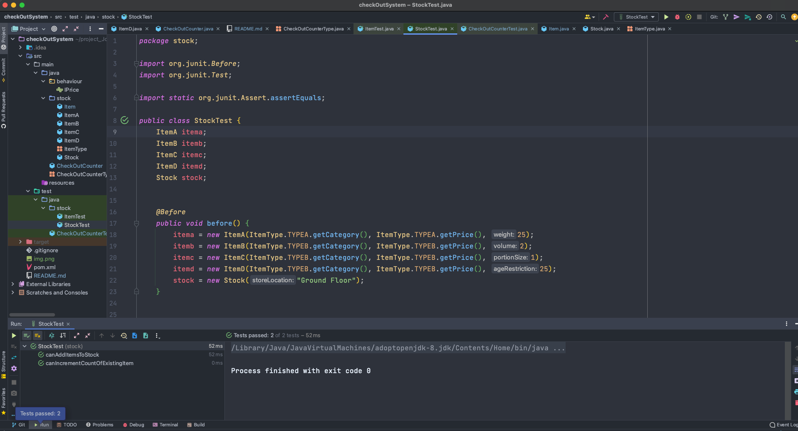

# CheckoutSystem
Implement the code for a checkout system that handles pricing schemes

#  Functionality

    -Checkout accepts items and calculate Running and  final total
    -Checkout accepts items in any order
    -Checkout implement pricing scheme and if items on offer it will calculate accordingly


#  Future Extensions
    -Updating the quantity in Stock when the item has been scanned for customer and delete the item from the stock when it reaches to zero.
    -Add the Database for persistence of data.
    -Adding user object having properties of name, age etc.
    -Checking age limit items before scanning for customers.


#  File Structure

```bash

├── README.md
├── pom.xml
├── src
│   ├── main
│   │   ├── java
│   │   │   ├── CheckOutCounter.java
│   │   │   ├── CheckOutCounterType.java
│   │   │   ├── behaviour
│   │   │   │   └── IPrice.java
│   │   │   └── stock
│   │   │       ├── Item.java
│   │   │       ├── ItemA.java
│   │   │       ├── ItemB.java
│   │   │       ├── ItemC.java
│   │   │       ├── ItemD.java
│   │   │       ├── ItemType.java
│   │   │       └── Stock.java
│   │   └── resources
│   └── test
│       └── java
│           ├── CheckOutCounterTest.java
│           └── stock
│               ├── ItemTest.java
│               └── StockTest.java
└── target
    ├── classes
    │   ├── CheckOutCounter.class
    │   ├── CheckOutCounterType.class
    │   ├── behaviour
    │   │   └── IPrice.class
    │   └── stock
    │       ├── Item.class
    │       ├── ItemA.class
    │       ├── ItemB.class
    │       ├── ItemC.class
    │       ├── ItemD.class
    │       ├── ItemType.class
    │       └── Stock.class
    ├── generated-sources
    │   └── annotations
    ├── generated-test-sources
    │   └── test-annotations
    └── test-classes
        ├── CheckOutCounterTest.class
        └── stock
            ├── ItemTest.class
            └── StockTest.class

```

#  Test_Passing_Screenshots

The below are the screenshot of all the tests.

-ItemTest


-StockTest



-CheckOutCounterTest


